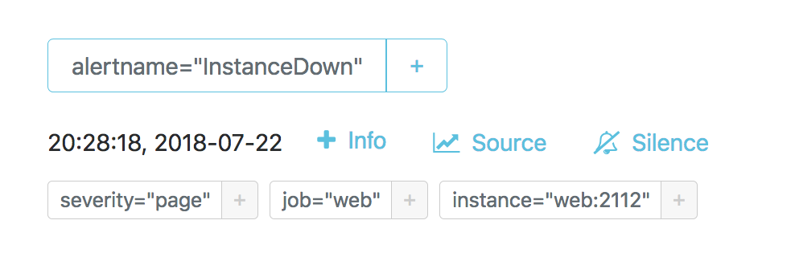

# Alertmanager sandbox

```bash
alias amtool='docker-compose run amtool amtool'
```

```bash
amtool alert
```

http://localhost:9090/graph?g0.range_input=1h&g0.expr=up&g0.tab=1

```bash
docker-compose stop web
```

```bash
docker-compose logs webhook
```

